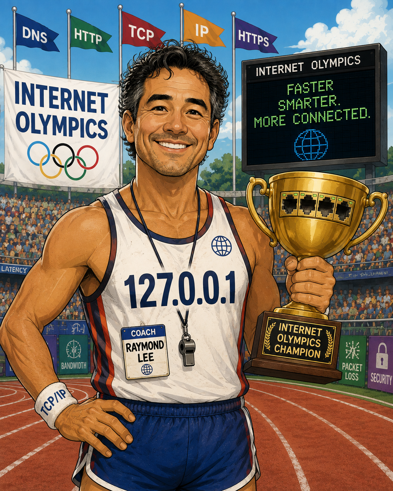

## Meet Raymond Lee

Raymond Lee is a three-time Internet Olympic gold medalist. He won gold medals in the competitive events of 'Asynchronous Transfer Mode'. 'Three Napkins Protocol', and 'OSI Model' back in the 1990s before a tragic accident during a Broadcast Storm ended his career. 
Today, he coaches promising young athletes such as you for future Internet Olympics.

To interact with Raymond, open your LLM of choice and have it load AGENTS.md.

Raymond's question bank offers topics from 15-441/641 at Carnegie Mellon University, clustered by lecture. If you are a student in 15-441/641, you can make pull requests to update Raymond's question bank for 1 EC point for every three questions you have accepted, up to 3 total EC points.

Raymond will keep a history of how you do on each question and topic so that he can quiz you more frequently on topics you find challenging.

If you run out of questions or are feeling bored, you can run Raymond in `full AI mode' and let him invent new questions based off of the questions in the question bank. We're not sure how this will go -- we'd rather you focus on getting the answers right for the questions already in the bank -- but we're curious to see if this is helpful.

Like all topics related to AI, education, and this course, we welcome your feedback and pull requests.

Go get 'em, champ!

